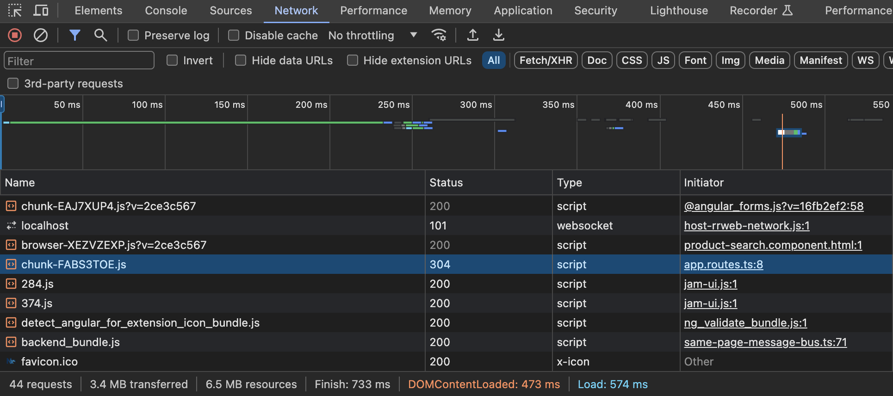

# Projeto criado na Mentoria Angular Pro

[](https://github.com/ortegavan/ecommerce/commits/) [](https://github.com/prettier) [](https://github.com/ortegavan/ecommerce/tags) [](https://github.com/ortegavan)

Este documento contém os exercícios feitos em aula + minhas notas pessoais sobre a Mentoria Angular Pro de Paolo Almeida e Andrew Rosário.

Se este documento for útil para você, considere deixar uma :star: no repositório.

## ✨ Aula 1

Explicação do escopo do projeto: trata-se de um e-commerce com as funcionalidades de cadastro/login, uma home e um catálogo de produtos. O projeto contempla o front-end desenvolvido em Angular com Nx e o uso de uma API fake disponível no [https://mockapi.io](https://mockapi.io).

## ✨ Aula 2

Criação do projeto utilizando o comando:

```bash
npx create-nx-workspace@latest ecommerce --preset=angular-standalone
```

Execução do projeto com o comando:

```bash
nx serve
```

## ✨ Aula 3

Criação da biblioteca de layout com o comando:

```bash
nx g @nx/angular:library --name=layout --directory=modules/feature/layout --projectNameAndRootFormat=as-provided --standalone=false --style=css
```

Visualização do gráfico de dependências do projeto com o comando:

```bash
nx graph
```

Criado componente header usando Nx Console a partir da pasta `modules/feature/layout/src/lib` passando as opções `export=true` e `standalone=false`. O comando gerado a partir do Nx Console foi:

```bash
npx nx generate @nx/angular:component --name=header --directory=header --export=true --standalone=false --nameAndDirectoryFormat=as-provided --no-interactive
```

Consumo da biblioteca de layout no projeto principal:

1. Importado o módulo `LayoutModule` em `app.component.ts`;
2. Adicionado o componente `ecommerce-header` em `app.component.html`;
3. Além disso, foi excluído o teste que não passava (fazendo referência a um título que não existe).

Feito isso, `nx lint` e `nx test` foram executados para garantir que o projeto está funcionando corretamente.

## ✨ Aula 4

Primeiro, foi estilizado o componente `header`. Em seguida, foram escritos testes unitários para o componente `header`:

```typescript
it(`should contain title`, () => {
    const header: HTMLHeadElement =
        fixture.nativeElement.querySelector('header');
    expect(header.textContent).toBe('Ecommerce');
});
```

E para o componente `app`:

```typescript
it(`should contain header`, () => {
    const header: HTMLElement = fixture.nativeElement.querySelector('header');
    expect(header).toBeTruthy();
});
```

## ✨ Aula 5

Instalado `husky` + `lint-staged` para rodar `nx lint` e `nx test` antes de cada commit. Seguem comandos:

```bash
npx husky-init && npm install
npm install lint-staged
```

Para configurar:

1. Substituir a instrução `npm test` por `npx lint-staged` no arquivo `.husky/pre-commit`;
2. Criar um arquivo `.lintstagedrc` na raiz da aplicação com o seguinte conteúdo:

```json
{
    "{src,modules}/**/*.{js,ts,jsx,tsx,json,html,css,scss}": [
        "nx affected:lint --fix --uncommitted",
        "nx affected:test",
        "nx format:write --uncommited"
    ]
}
```

3. Adicionar a regra abaixo na seção `rules` do arquivo `eslintrc.base.json` para permitir o uso de `console.warn` e `console.error` no código mas não permitir `console.log`:

```json
"no-console": [
    "error",
    {
    "allow": ["warn", "error"]
    }
],
```

4. Testar o commit.

## ✨ Aula 6

Criado o módulo `product-data-access` com o comando:

```bash
npx nx g @nx/angular:library --name=product-data-access --directory=modules/data-access/product --projectNameAndRootFormat=as-provided
```

O componente `product-data-access` foi excluído e removido da `index.ts`.

**Notas**

Para que o commit funcionasse, precisei alterar na configuração do `lint-staged`:

1. Removi `js` e `css` do `nx lint`;
2. Acrescentei `--passWithNoTests` no `nx test`.

Criada a model `Product` em `modules/data-access/product/src/lib/models/product.ts`:

```typescript
export type Product = {
    createdAt: string;
    name: string;
    price: string;
    description: string;
    image: string;
    id: string;
    quantity: number;
};
```

Criado o serviço para busca de produtos com o comando:

```bash
npx nx g @schematics/angular:service --name=product-search --project=product-data-access --flat=false
```

Em `src/app/app.config.ts` foi importado o `HttpClient` via `provideHttpClient()`.

Por último, foi implementado o teste através do `HttpClientTestingModule` e `HttpTestingController` para o serviço `ProductSearchService`.

## 🍺 Pausa para meus ajustes

Alterei meu `.prettierrc` para usar 4 espaços em vez de 2 nas formatações:

```json
{
    "singleQuote": true,
    "useTabs": false,
    "tabWidth": 4
}
```

Rodei o comando abaixo para reformatar todos os arquivos do projeto com o novo espaçamento:

```bash
nx format:write --all
```

Reestilizei alguns componentes e apliquei uma nova fonte ao projeto:

1. Adicionei a fonte [Montserrat](https://fonts.google.com/specimen/Montserrat) na `index.html`;
2. Alterei `modules/feature/layout/src/lib/header/header.component.css`;
3. Alterei `styles.css`.

🌸 Floreei 🌸 este README.md.

## ✨ Aula 7

Foi instalado/adicionado ao projeto o Angular Material com os comandos abaixo:

```bash
npm install @angular/material
npx nx g @angular/material:ng-add --project=ecommerce
```

Em seguida, foi criado o módulo Product Search com o comando:

```bash
npx nx g @nx/angular:library --name=product-search --directory=modules/feature/product/search --projectNameAndRootFormat=as-provided --style=css
```

Os dados do Data Access foram exportados via `modules/data-access/product/src/lib/index.ts`:

```typescript
export * from './lib/mocks/product.mock';
export * from './lib/product-search/product-search.service';
```

O componente `product-search` foi implementado usando o componente [Autocomplete](https://material.angular.io/components/autocomplete/overview#automatically-highlighting-the-first-option) do Angular Material;

O padrão de composição foi aplicado no componente `header`:

```html
<header class="header">
    <h1 class="logo">{{ title }}</h1>
    <ng-content></ng-content>
    <ng-content select="[right]"></ng-content>
</header>
```

E o componente foi então consumido no `app.component.html`:

```html
<ecommerce-header title="e-Commerce">
    <ecommerce-product-search></ecommerce-product-search>
    <p right>Login</p>
</ecommerce-header>
<router-outlet></router-outlet>
```

Por fim, para os testes rodarem corretamente, foram desabilitadas as animações do Angular Material no `product.search.component.spec.ts`:

```typescript
import { NoopAnimationsModule } from '@angular/platform-browser/animations';
```

## 🍺 Pausa para meus ajustes

-   Setei a propriedade `subscriptSizing` do campo de busca para `dynamic` para alinhar o componente verticalmente;
-   Removi a fonte Roboto da `index.html` porque já havia configurado a Montserrat;
-   Temporariamente, coloquei um ícone no lugar do texto "Login" no `app.component.html` até definirmos o próximo componente.

## ✨ Aula 8

Foi implementada a busca de produtos no componente `product-search` com o uso do `FormControl` e operadores do RxJS para evitar requisições desnecessárias e foi utilizado pipe async para subscrever o observable no template.

```typescript
this.products$ = this.control.valueChanges.pipe(
    debounceTime(333),
    distinctUntilChanged(),
    filter((text) => text.length > 1),
    switchMap((text) => this.productSearchService.searchByName(text))
);
```

## ✨ Aula 9

Foram implementados testes para o componente `product-search` e para o serviço `ProductSearchService`. Utilizamos `FakeAsync` + `tick` para simular o tempo de espera da requisição e usamos spy para verificar se o método `searchByName` foi chamado.

## ✨ Aula 10

Nesta aula, criamos o módulo `home` com o comando:

```bash
nx g @nx/angular:library --name=home --directory=modules/feature/home --lazy=true --routing=true --projectNameAndRootFormat=as-provided --style=css
```

Discutimos as estratégias de preloading disponíveis no Angular e implementamos o lazy loading do módulo `home`. Aprendi que o lazy loading pode ser configurado usando `loadChildren` apontando para o módulo de rotas:

```typescript
export const appRoutes: Route[] = [
    { path: '', redirectTo: 'home', pathMatch: 'full' },
    {
        path: 'home',
        loadChildren: () => import('@ecommerce/home').then((r) => r.homeRoutes),
    },
];
```

Vimos o lazy loading em ação ao inspecionar a aplicação no navegador:



Mais sobre as estratégias de preloading pode ser visto [neste post](https://dev.to/this-is-angular/optimize-your-angular-apps-user-experience-with-preloading-strategies-3ie7).
