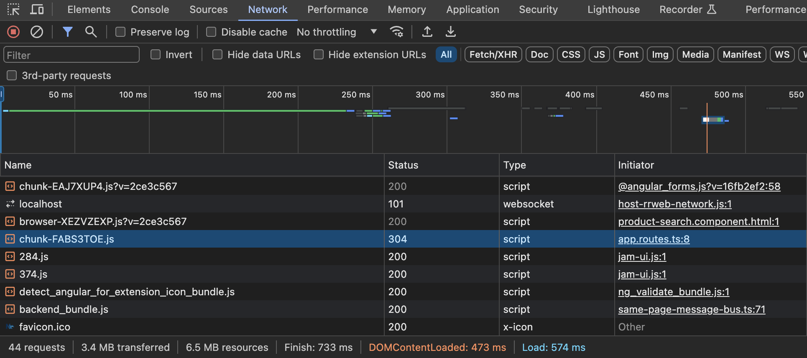

# Projeto criado na Mentoria Angular Pro

  

Este documento contém os exercícios feitos em aula + minhas notas pessoais sobre a Mentoria Angular Pro de Paolo Almeida e Andrew Rosário.

Em aula, os mentores utilizam `scss`. Eu optei por usar `css` por ter mais prática com ele. Os scripts do Nx que criam libs com `scss`, na mentoria, foram alterados aqui para `css`.

Se este documento for útil para você, considere deixar uma :star: no repositório.

## ✨ Aula 1

Explicação do escopo do projeto: trata-se de um e-commerce com as funcionalidades de cadastro/login, uma home e um catálogo de produtos. O projeto contempla o front-end desenvolvido em Angular com Nx e o uso de uma API fake disponível no [https://mockapi.io](https://mockapi.io).

## ✨ Aula 2

Criação do projeto utilizando o comando:

```bash
npx create-nx-workspace@latest ecommerce --preset=angular-standalone
```

Execução do projeto com o comando:

```bash
nx serve
```

## ✨ Aula 3

Criação da biblioteca de layout com o comando:

```bash
nx g @nx/angular:library --name=layout --directory=modules/feature/layout --projectNameAndRootFormat=as-provided --standalone=false --style=css
```

Visualização do gráfico de dependências do projeto com o comando:

```bash
nx graph
```

Criado componente header usando Nx Console a partir da pasta `modules/feature/layout/src/lib` passando as opções `export=true` e `standalone=false`. O comando gerado a partir do Nx Console foi:

```bash
npx nx generate @nx/angular:component --name=header --directory=header --export=true --standalone=false --nameAndDirectoryFormat=as-provided --no-interactive
```

Consumo da biblioteca de layout no projeto principal:

1. Importado o módulo `LayoutModule` em `app.component.ts`;
2. Adicionado o componente `ecommerce-header` em `app.component.html`;
3. Além disso, foi excluído o teste que não passava (fazendo referência a um título que não existe).

Feito isso, `nx lint` e `nx test` foram executados para garantir que o projeto está funcionando corretamente.

## ✨ Aula 4

Primeiro, foi estilizado o componente `header`. Em seguida, foram escritos testes unitários para o componente `header`:

```typescript
it(`should contain title`, () => {
    const header: HTMLHeadElement =
        fixture.nativeElement.querySelector('header');
    expect(header.textContent).toBe('Ecommerce');
});
```

E para o componente `app`:

```typescript
it(`should contain header`, () => {
    const header: HTMLElement = fixture.nativeElement.querySelector('header');
    expect(header).toBeTruthy();
});
```

## ✨ Aula 5

Instalado `husky` + `lint-staged` para rodar `nx lint` e `nx test` antes de cada commit. Seguem comandos:

```bash
npx husky-init && npm install
npm install lint-staged
```

Para configurar:

1. Substituir a instrução `npm test` por `npx lint-staged` no arquivo `.husky/pre-commit`;
2. Criar um arquivo `.lintstagedrc` na raiz da aplicação com o seguinte conteúdo:

```json
{
    "{src,modules}/**/*.{js,ts,jsx,tsx,json,html,css,scss}": [
        "nx affected:lint --fix --uncommitted",
        "nx affected:test",
        "nx format:write --uncommited"
    ]
}
```

3. Adicionar a regra abaixo na seção `rules` do arquivo `eslintrc.base.json` para permitir o uso de `console.warn` e `console.error` no código mas não permitir `console.log`:

```json
"no-console": [
    "error", {
        "allow": ["warn", "error"]
    }
],
```

4. Testar o commit.

## ✨ Aula 6

Criado o módulo `product-data-access` com o comando:

```bash
npx nx g @nx/angular:library --name=product-data-access --directory=modules/data-access/product --projectNameAndRootFormat=as-provided
```

O componente `product-data-access` foi excluído e removido da `index.ts`.

**Notas**

Para que o commit funcionasse, precisei alterar na configuração do `lint-staged`:

1. Removi `js` e `css` do `nx lint`;
2. Acrescentei `--passWithNoTests` no `nx test`.

Criada a model `Product` em `modules/data-access/product/src/lib/models/product.ts`:

```typescript
export type Product = {
    createdAt: string;
    name: string;
    price: string;
    description: string;
    image: string;
    id: string;
    quantity: number;
};
```

Criado o serviço para busca de produtos com o comando:

```bash
npx nx g @schematics/angular:service --name=product-search --project=product-data-access --flat=false
```

Em `src/app/app.config.ts` foi importado o `HttpClient` via `provideHttpClient()`.

Por último, foi implementado o teste através do `HttpClientTestingModule` e `HttpTestingController` para o serviço `ProductSearchService`.

## 🍺 Pausa para meus ajustes

Alterei meu `.prettierrc` para usar 4 espaços em vez de 2 nas formatações:

```json
{
    "singleQuote": true,
    "useTabs": false,
    "tabWidth": 4
}
```

Rodei o comando abaixo para reformatar todos os arquivos do projeto com o novo espaçamento:

```bash
nx format:write --all
```

Reestilizei alguns componentes e apliquei uma nova fonte ao projeto:

1. Adicionei a fonte [Montserrat](https://fonts.google.com/specimen/Montserrat) na `index.html`;
2. Alterei `modules/feature/layout/src/lib/header/header.component.css`;
3. Alterei `styles.css`.

🌸 Floreei 🌸 este README.md.

## ✨ Aula 7

Foi instalado/adicionado ao projeto o Angular Material com os comandos abaixo:

```bash
npm install @angular/material
npx nx g @angular/material:ng-add --project=ecommerce
```

Em seguida, foi criado o módulo Product Search com o comando:

```bash
npx nx g @nx/angular:library --name=product-search --directory=modules/feature/product/search --projectNameAndRootFormat=as-provided --style=css
```

Os dados do Data Access foram exportados via `modules/data-access/product/src/lib/index.ts`:

```typescript
export * from './lib/mocks/product.mock';
export * from './lib/product-search/product-search.service';
```

O componente `product-search` foi implementado usando o componente [Autocomplete](https://material.angular.io/components/autocomplete/overview#automatically-highlighting-the-first-option) do Angular Material;

O padrão de composição foi aplicado no componente `header`:

```html
<header class="header">
    <h1 class="logo">{{ title }}</h1>
    <ng-content></ng-content>
    <ng-content select="[right]"></ng-content>
</header>
```

E o componente foi então consumido no `app.component.html`:

```html
<ecommerce-header title="e-Commerce">
    <ecommerce-product-search></ecommerce-product-search>
    <p right>Login</p>
</ecommerce-header>
<router-outlet></router-outlet>
```

Por fim, para os testes rodarem corretamente, foram desabilitadas as animações do Angular Material no `product.search.component.spec.ts`:

```typescript
import { NoopAnimationsModule } from '@angular/platform-browser/animations';
```

## 🍺 Pausa para meus ajustes

-   Setei a propriedade `subscriptSizing` do campo de busca para `dynamic` para alinhar o componente verticalmente;
-   Removi a fonte Roboto da `index.html` porque já havia configurado a Montserrat;
-   Temporariamente, coloquei um ícone no lugar do texto "Login" no `app.component.html` até definirmos o próximo componente.

## ✨ Aula 8

Foi implementada a busca de produtos no componente `product-search` com o uso do `FormControl` e operadores do RxJS para evitar requisições desnecessárias e foi utilizado pipe async para subscrever o observable no template.

```typescript
this.products$ = this.control.valueChanges.pipe(
    debounceTime(333),
    distinctUntilChanged(),
    filter((text) => text.length > 1),
    switchMap((text) => this.productSearchService.searchByName(text))
);
```

## ✨ Aula 9

Foram implementados testes para o componente `product-search` e para o serviço `ProductSearchService`. Utilizamos `FakeAsync` + `tick` para simular o tempo de espera da requisição e usamos spy para verificar se o método `searchByName` foi chamado.

## ✨ Aula 10

Nesta aula, criamos o módulo `home` com o comando:

```bash
nx g @nx/angular:library --name=home --directory=modules/feature/home --lazy=true --routing=true --projectNameAndRootFormat=as-provided --style=css
```

Discutimos as estratégias de preloading disponíveis no Angular e implementamos o lazy loading do módulo `home`. Aprendi que o lazy loading pode ser configurado usando `loadChildren` apontando para o módulo de rotas:

```typescript
export const appRoutes: Route[] = [
    { path: '', redirectTo: 'home', pathMatch: 'full' },
    {
        path: 'home',
        loadChildren: () => import('@ecommerce/home').then((r) => r.homeRoutes),
    },
];
```

Vimos o lazy loading em ação ao inspecionar a aplicação no navegador:



Mais sobre as estratégias de preloading pode ser visto [neste post](https://dev.to/this-is-angular/optimize-your-angular-apps-user-experience-with-preloading-strategies-3ie7).

## ✨ Aula 11

Implementamos a seção de produtos recomendados, por enquanto com mock de dados. Conversamos sobre HTML semântico e a importância de usar tags apropriadas para melhorar a acessibilidade e SEO. Famos sobre o padrão BEM para nomenclatura de classes do CSS.

Mais sobre padrões de acessibilidade pode ser visto [neste link](https://www.w3.org/WAI/ARIA/apg/patterns/).

## ✨ Aula 12

Criamos o serviço de produtos recomendados agora buscando da API (antes usávamos mock) e refatoramos a home para separar o código responsável pelo card de produto.

## ✨ Aula 13

Criamos a lib para exibir os detalhes de um produto com o comando:

```bash
npx nx g @nx/angular:library --name=product-detail --directory=modules/feature/product/detail --lazy=true --routing=true --projectNameAndRootFormat=as-provided --style=css
```

Habilitamos a captura de parâmetros através de input no componente adicionando a função `withComponentInputBinding` no `app.config.ts`:

```typescript
export const appConfig: ApplicationConfig = {
    providers: [
        provideRouter(appRoutes, withComponentInputBinding()),
        provideHttpClient(),
        provideAnimationsAsync(),
    ],
};
```

Para os testes passarem, foi necessário adicionar o `RouterTestingModule` em `product-detail.component.spec.ts`.

## ✨ Aula 14

Implementamos _module boundaries_ para garantir as regras:

-   `type:data-access` deve ser capaz de importar de `type:data-access`;
-   `type:feature` deve ser capaz de importar de `type:feature`, `type:ui` e `type:data-access`;
-   `type:ui` deve ser capaz de importar de `type:ui` e `type:data-access`

Para aplicar as regras, precisamos dos dois passos:

1. Atribuir um identificador às nossas libs. Isso é feito adicionando-se tags no arquivo `project.json` (exemplo abaixo para a lib `product-data-access`):

```json
"tags": ["type:data-access"]
```

2. Definir as regras de importação no arquivo `.eslintrc.base.json` no array `depConstraints` do plugin `@nx/enforce-module-boundaries`:

```json
{
    "sourceTag": "type:data-access",
    "onlyDependOnLibsWithTags": ["type:data-access"]
},
{
    "sourceTag": "type:feature",
    "onlyDependOnLibsWithTags": [
        "type:feature",
        "type:ui",
        "type:data-access"
    ]
},
{
    "sourceTag": "type:ui",
    "onlyDependOnLibsWithTags": [
        "type:ui",
        "type:data-access"
    ]
}
```

Mais sobre _module boundaries_ pode ser visto [neste link](https://nx.dev/features/enforce-module-boundaries) e [neste link](https://andrewrosario.medium.com/definindo-limites-de-módulos-no-nx-com-module-boundaries-4088f758957f).

## ✨ Aula 15

Criamos um pipe customizado e vimos a diferença entre um pipe puro e um pipe impuro. O pipe customizado foi criado com o comando:

```bash
nx g @nx/angular:pipe --name=quantity-description --directory=modules/feature/product/detail/src/lib/pipes/quantity-description --nameAndDirectoryFormat=as-provided
```

Vimos a importância de utilizar o pipe em vez de chamar funções diretamente no template pois o change detection do Angular é mais eficiente. Mais sobre pipes pode ser visto [neste link](https://andrewrosario.medium.com/angular-pipes-uma-visão-mais-profunda-69e2413c34d8).

## ✨ Aula 16

Criamos um interceptor para tratar erros nas requisições HTTP. O interceptor foi criado com o comando:

```bash
nx g @schematics/angular:interceptor --name=http-errors --project=ecommerce --flat=false --path=src/app/interceptors
```

Utilizamos o snack bar do Angular Material para exibir mensagens de erro ao usuário. O código final do interceptor ficou assim:

```typescript
export const httpErrorsInterceptor: HttpInterceptorFn = (req, next) => {
    const snackBar = inject(MatSnackBar);

    return next(req).pipe(
        catchError((err) => {
            snackBar.open('Ops, ocorreu um erro', 'Fechar', {
                duration: 5000,
            });

            return throwError(() => err);
        })
    );
};
```

No teste do interceptor, forçamos um erro na requisição e verificamos se o snack bar foi chamado:

```typescript
it('should open notification on http error', () => {
    jest.spyOn(snackBar, 'open');
    httpClient.get('/test').subscribe();

    const request = httpMock.expectOne('/test');
    request.error(new ProgressEvent('error'));

    expect(snackBar.open).toHaveBeenCalled();
});
```

## ✨ Aula 17

Discutimos sobre gerenciamento de estado e falamos sobre as libs disponíveis no mercado para isso no Angular. No entanto, concordamos que na maioria das vezes é possível gerenciar o estado apenas com RxJS ou Signals, fugindo da complexidade que estas libs trazem.

Criamos uma service para gerenciar o estado do carrinho de compras com o comando:

```bash
nx g @schematics/angular:service --name=cart --project=product-data-access --flat=false --path=modules/data-access/product/src/lib/state
```

E, nesta service, implementamos o gerenciamento de estado a) primeiro com RxJS:

```typescript
private cartSubject$ = new BehaviorSubject<Product[]>([]);
cart$ = this.cartSubject$.asObservable();
quantity$ = this.cart$.pipe(map((products) => products.length));

addToCart(product: Product) {
    const cart = this.cartSubject$.getValue();
    this.cartSubject$.next([...cart, product]);
}
```

b) e depois com Signals:

```typescript
private cartSignal = signal<Product[]>([]);
cart = this.cartSignal.asReadonly();
quantity = computed(() => this.cart().length);

addToCart(product: Product) {
    this.cartSignal.update((cart) => [...cart, product]);
}
```

## ✨ Aula 18

Criamos o componente `CartComponent` para exibir a quantidade de itens no carrinho usando o Badge do Angular Material. Para termos acesso ao estado do carrinho, utilizamos o serviço `CartService` com o signal já implementado anteriormente. O componente foi, então, consumido em `app.component.html`.

## ✨ Aula 19

Criado primeiro script de integração contínua disponível em `.github/workflows/ci.yml` que executa formatação, lint e testes no projeto a cada push na `main` ou novo pull request.

## ✨ Aula 20

Configuramos uma conta na Vercel e importamos o projeto do GitHub para a plataforma. A partir de agora, o deploy será feito automaticamente a cada push na branch `main`.

Também criamos a nova lib que será usada para construir o formulário para autenticação do usuário:

```bash
npx nx g @nx/angular:library --name=auth-form --directory=modules/feature/auth/form --lazy=true --routing=true --projectNameAndRootFormat=as-provided --style=css --tags=type:feature
```

E adicionamos nova rota no `appRoutes` para o módulo de autenticação:

```typescript
{
    path: 'auth',
    loadChildren: () =>
        import('@ecommerce/auth-form').then((r) => r.authFormRoutes),
},
```

## ✨ Aula 21

Começamos a construir um formulário reativo em etapas utilizando um componente como orquestrador tendo seu próprio `router-outlet`. Cada etapa do formulário é um componente filho separado com rotas configuradas no arquivo `lib.routes.ts` da lib de autenticação.

Os componentes filhos conseguem acessar o componente pai via injeção de dependência (sim, de componentes!) e, assim, compartilhar informações entre si. Para saber mais, acesse [este link](https://angular.dev/guide/di/hierarchical-dependency-injection).

Para cenários mais genéricos, é possível criar uma classe abstrata que os orquestradores implementam para serem injetadas nos componentes filhos. Para saber mais, acesse [este link](https://netbasal.com/create-a-multi-step-form-in-angular-44cdc5b75cdc).

Formulários complexos também podem ser divididos com [ControlContainer](https://andrewrosario.medium.com/dividindo-formulários-complexos-no-angular-com-controlcontainer-1b107d59c8be) e com [ControlValueAccessor](https://andrewrosario.medium.com/form-controls-customizados-no-angular-com-controlvalueaccessor-367e773e3fec).

## ✨ Aula 22

Finalizamos o formulário iniciado na aula anterior e implementamos os testes. Foi necessário fornecer rotas com `provideRouter` e importar o `NoopAnimationsModule` para os testes passarem. Para testarmos a interação com o HTML do form, substituímos a manipulação do `FormControl` como mostrado a seguir:

```typescript
it('should display email error message', () => {
    // component.control.setValue('teste');
    const input: HTMLInputElement =
        fixture.nativeElement.querySelector('input');
    input.value = 'teste';
    input.dispatchEvent(new Event('input'));

    component.control.markAllAsTouched();
    fixture.detectChanges();
    const error = fixture.nativeElement.querySelector(
        '[data-testid="error-email"]'
    );

    expect(error).toBeTruthy();
});
```

Onde `data-testid` é um atributo customizado que usamos para identificar elementos no HTML.

## ✨ Aula 23

Criamos uma nova lib para gerenciar autenticação com o comando:

```bash
nx g @nx/angular:library --name=auth-data-access --directory=modules/data-access/auth --projectNameAndRootFormat=as-provided --standalone=false --tags=type:data-access
```

Criamos uma nova service para armazenar o estado de autenticação com o comando:

```bash
npx nx g @schematics/angular:service --name=auth --project=auth-data-access --flat=false
```

Criamos a função `authGuard` para ser utilizada como guarda da rota de login que redireciona para a home caso o usuário já esteja autenticado ou retorna `true` no `canActivate` caso contrário, permitindo o acesso à tela de autenticação.

## ✨ Aula 24

Criamos, implementamos alguns casos de uso e escrevemos testes para a diretiva `Log`. Mais sobre diretivas pode ser visto [neste link](https://andrewrosario.medium.com/desmistificando-as-poderosas-diretivas-no-angular-ad2c3840a712) e [neste link](https://andrewrosario.medium.com/injetando-componentes-no-angular-através-de-diretivas-cae90992e83).

## ✨ Aula 25

Implementamos alguns testes E2E com Cypress. Rodamos o Cypress em modo headless com o comando:

```bash
nx e2e e2e
```

Rodamos Cypress via interface gráfica com o comando:

```bash
npx cypress open --project ./e2e
```

Obs. 1: o parâmetro `--watch` foi descontinuado.

Obs. 2: precisei reconfigurar o `tsconfig.json` do Cypress para que o TypeScript reconhecesse os tipos do Cypress.

Alteramos o workflow de CI para executar os testes E2E adicionando o comando a seguir:

```yml
- run: npx nx affected -t e2e --parallel=3 --configuration=ci
```
